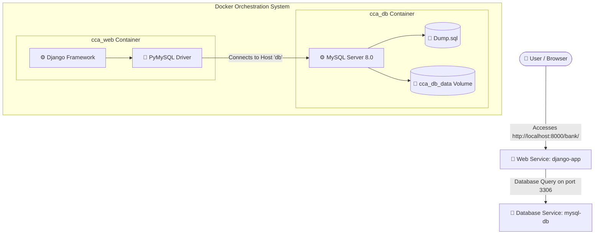

# CCABank Dockerization & Setup Guide

This guide walks you through the containerized architecture and deployment of **CCABank**, a Django web application backed by a MySQL database.

---

## 🏗️ Architecture & Component Overview

The application is orchestrated using Docker Compose as a multi-container system:



---

## 🛠️ Created Configurations

To Dockerize the application, the following files were added to the `CCABank` root:

### 1. `Dockerfile`
A lightweight, cache-optimized build recipe using `python:3.11-slim` that copies the Django application code and sets up the server command:
*   [Dockerfile](Dockerfile)

### 2. `docker-compose.yml`
Orchestrates both the Django web application and the MySQL database, ensuring correct launch order via database healthchecks:
*   [docker-compose.yml](docker-compose.yml)

### 3. `requirements.txt`
Declares Django and `PyMySQL` as the dependencies:
*   [requirements.txt](requirements.txt)

### 4. `.dockerignore`
Excludes developer environments, local database files, logs, and build artifacts from the image context to minimize build time and size:
*   [.dockerignore](.dockerignore)

---

## ⚙️ Application Modifications Made

To make the existing Django code cloud-native and Docker-ready, the following updates were performed:

### 1. Dynamic Database Configuration
In `MyProject/settings.py`, database parameters were refactored to read from environment variables, falling back to local credentials when run outside containers:
```python
import os
import pymysql
pymysql.install_as_MySQLdb()

DATABASES = {
    'default': {
        'ENGINE': 'django.db.backends.mysql',
        'NAME': os.environ.get('DB_NAME', 'db_cca_bank'),
        'USER': os.environ.get('DB_USER', 'root'),
        'PASSWORD': os.environ.get('DB_PASSWORD', 'Admin@123'),
        'HOST': os.environ.get('DB_HOST', 'localhost'),
        'PORT': os.environ.get('DB_PORT', '3306'),
    }
}
```
> [!NOTE]
> We installed `pymysql` and called `install_as_MySQLdb()`. This bypasses the need for the native `mysqlclient` C compiler dependencies (`gcc`, `default-libmysqlclient-dev`), ensuring a fast and clean Python build in offline/restricted sandbox networks.

### 2. Typo Fix in `db_repository.py`
We corrected a database schema reference typo inside the `transfermoney` queries of `MyProject/bankapp/db_repository.py`. The query was modified from querying `db_bank.users` to querying `users` dynamically relative to the connected database (`db_cca_bank`).

---

## 🚀 Running the Application

### Start Services
Spin up both services in detached mode:
```bash
docker compose up --build -d
```

### Stop & Cleanup Services
Stop the containers and reclaim resources:
```bash
docker compose down
```
To also purge the database volumes and start completely fresh:
```bash
docker compose down -v
```

---

## 🔍 Verification & Inspection

### 1. Check Container Status
Verify that both containers are active:
```bash
docker ps
```
Both `cca_db` (with a `healthy` tag) and `cca_web` should show `Up`.

### 2. View Server Logs
Check the Django startup logs:
```bash
docker logs cca_web
```

### 3. Query Application Endpoint
Verify the web page serves successfully:
```bash
curl -I http://localhost:8000/bank/
```
Should return `HTTP/1.1 200 OK`. You can access the bank app in your browser at `http://localhost:8000/bank/`.
