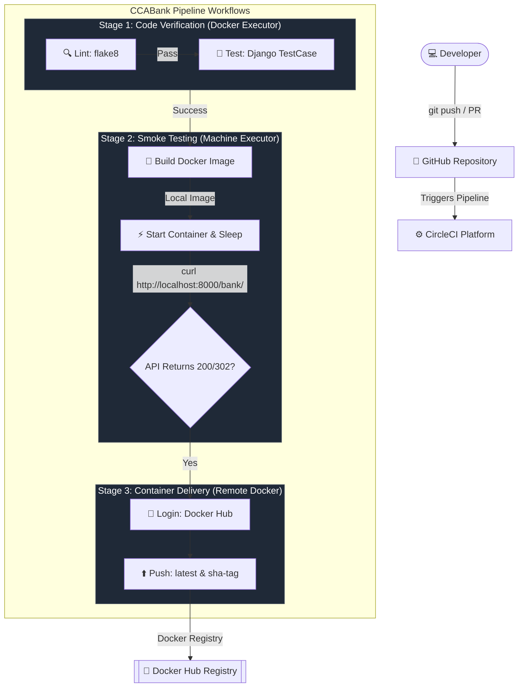

# CircleCI Configuration & Integration Manual: CCABank CI/CD Guide

This manual serves as a comprehensive educational guide to introducing **CircleCI** as a Continuous Integration and Continuous Delivery (CI/CD) platform. It covers core concepts, details how CircleCI compares with GitHub Actions, explains the configuration schema, and provides a step-by-step walkthrough for implementing a production-ready pipeline for the **CCABank** application.

---

## 📖 1. The Big Picture: What is CircleCI?

**CircleCI** is a modern, SaaS-first CI/CD platform designed to automate software development workflows. It integrates with version control systems (like GitHub, GitLab, and Bitbucket) and runs automated tasks on every code change.

```
                    ┌────────────────────────────────────────┐
                    │        THE CIRCLECI PIPELINE           │
    ┌────────┐      ▼      ┌─────────┐      ┌─────────┐      │
    │  PUSH  │ ──(Git)───> │EXECUTOR │ ───> │  JOBS   │ ─────┤
    └────────┘             └─────────┘      └─────────┘      │
        ▲                                                    │
        │                                                    ▼
    ┌────────┐             ┌─────────┐      ┌─────────┐  ┌───────┐
    │ DEPLOY │ <────────── │ REGISTRY│ <──── │ WORKFLOW│  │ CACHE │
    └────────┘             └─────────┘      └─────────┘  └───────┘
```

### Why Choose CircleCI?
1. **Speed & Concurrency**: Excellent caching mechanisms and resource class tuning (allowing you to choose CPU/RAM sizes for your runners).
2. **Flexible Executors**: Out-of-the-box support for running jobs in clean Docker containers, dedicated Linux VMs (machine), macOS VMs (for iOS apps), or Windows environments.
3. **SSH Debugging**: Rerun any failed build with SSH enabled, allowing you to log directly into the runner container/VM and inspect logs, databases, or processes.
4. **Declarative Pipelines**: Configuration is completely written in YAML and stored directly in your git repository at `.circleci/config.yml`.

---

## 🛠️ 2. CircleCI vs. GitHub Actions

Both platforms are industry standards, but they differ in configuration syntax, execution environments, and ecosystem integration.

### 📋 Comparison Matrix

| Feature | GitHub Actions | CircleCI |
| :--- | :--- | :--- |
| **Configuration File** | `.github/workflows/*.yml` (Multiple workflows allowed) | `.circleci/config.yml` (Single entry point file) |
| **Pipeline Hierarchy** | Workflow ➔ Jobs ➔ Steps | Pipeline ➔ Workflows ➔ Jobs ➔ Steps |
| **Execution Environment** | Defined via `runs-on: <runner-os>` | Defined via `executor` (Docker, Machine, macOS, Windows) |
| **Pre-built Templates** | GitHub Marketplace Actions (`uses: ...`) | CircleCI Orbs (`orbs: ...`) |
| **Secrets Management** | GitHub Secrets (referenced in YAML) | CircleCI Environment Variables or Contexts (injected automatically) |
| **Local Debugging** | Requires third-party tools (like `act`) | Native "Rerun Job with SSH" feature |
| **Docker-in-Docker** | Built-in via Docker daemon on GitHub runner | Requires `setup_remote_docker` step in Docker executor |

### 🔄 Syntax Mapping Guide

If you are migrating from GitHub Actions to CircleCI, use this quick reference mapping:

| GitHub Actions Syntax | CircleCI Syntax | Description |
| :--- | :--- | :--- |
| `runs-on: ubuntu-latest` | `docker: - image: cimg/base:stable` <br> or `machine: true` | Specifies the runner OS or container environment. |
| `uses: actions/checkout@v4` | `- checkout` | Clones the repository code into the working directory. |
| `uses: actions/cache@v4` | `- restore_cache` <br> `- save_cache` | Saves/restores folders (like pip packages) between runs. |
| `${{ secrets.DOCKER_HUB_TOKEN }}` | `$DOCKERHUB_TOKEN` | Accesses secure environmental credentials. |
| `needs: job-name` | `requires: - job-name` (in workflows block) | Defines sequence and job dependency chains. |
| `on: push: branches: [main]` | `filters: branches: only: - main` | Restricts job execution to specific branches. |

---

## 🧠 3. Core CircleCI Concepts

Before writing your configuration, you must understand the building blocks of CircleCI:

### 1. Executors
An **Executor** defines the hardware and software environment in which your steps will execute.
* **Docker Executor (`docker`)**: Runs your steps inside a specified Docker image (e.g., `cimg/python:3.11`). It is fast, lightweight, and customizable.
* **Machine Executor (`machine`)**: Spins up a dedicated Ubuntu Linux VM with root access and a dedicated Docker daemon.
  > [!IMPORTANT]
  > **The Localhost Networking Gotcha**: When using the *Docker Executor* with `setup_remote_docker` to build containers, the Docker containers run on a separate remote VM. Therefore, you cannot access them via `localhost`. If you need to spin up a container and run smoke tests against it (like our API curl validation), you must use the **Machine Executor** so that the container runs locally and binds directly to `localhost`.

### 2. Jobs
A **Job** is a collection of steps run in a single container or VM. Jobs run in parallel unless orchestrated otherwise by a workflow.

### 3. Steps
**Steps** are sequential actions executed within a job. These can be shell commands (`run`), built-in utility commands (`checkout`, `restore_cache`), or external plugins (`orbs`).

### 4. Workflows
A **Workflow** orchestrates a set of jobs and controls their execution order. You use workflows to define dependencies (e.g., "only build the Docker image if unit tests pass") and branch filtering.

### 5. Caching
CircleCI allows you to cache files (like installed Python dependencies in `~/.cache/pip`) across jobs using a unique cache key (often a hash of your dependency lock file, e.g., `requirements.txt`). This saves significant setup time.

---

## 🏗️ 4. Architectural Overview of CCABank CircleCI Pipeline

The CircleCI pipeline validates and delivers the CCABank Django application in three distinct stages:



---

## ⚙️ 5. Configuration File Breakdown (`.circleci/config.yml`)

Here is the production-grade CircleCI configuration configured for CCABank.

```yaml
version: 2.1

jobs:
  # ========================================================
  # JOB 1: LINT & RUN TESTS
  # ========================================================
  lint-and-test:
    docker:
      - image: cimg/python:3.11
    working_directory: ~/project/CCABank
    steps:
      - checkout:
          path: ~/project
      - restore_cache:
          keys:
            - v1-dependencies-{{ checksum "requirements.txt" }}
            - v1-dependencies-
      - run:
          name: Install Dependencies
          command: |
            python -m pip install --upgrade pip
            pip install flake8
            if [ -f requirements.txt ]; then pip install -r requirements.txt; fi
      - save_cache:
          paths:
            - ~/.cache/pip
          key: v1-dependencies-{{ checksum "requirements.txt" }}
      - run:
          name: Lint Code with Flake8
          command: |
            # Stop the build on syntax errors or undefined names
            flake8 MyProject --count --select=E9,F63,F7,F82 --show-source --statistics
            # exit-zero treats all errors as warnings
            flake8 MyProject --count --exit-zero --max-complexity=10 --max-line-length=127 --statistics
      - run:
          name: Run Django Tests
          command: |
            python MyProject/manage.py test bankapp

  # ========================================================
  # JOB 2: DOCKER BUILD & SMOKE TEST
  # ========================================================
  build-and-validate-docker:
    machine:
      image: ubuntu-2204:current
    working_directory: ~/project/CCABank
    steps:
      - checkout:
          path: ~/project
      - run:
          name: Build Docker Image Locally
          command: |
            docker build -t ccabank:local .
      - run:
          name: Start Docker Container (Smoke Test)
          command: |
            # Spin up container on port 8000 with SQLite fallback enabled
            docker run -d --name ccabank_test -e USE_SQLITE=True -p 8000:8000 ccabank:local
            echo "Waiting for Django server to bind..."
            sleep 10
      - run:
          name: Run Smoke Test API Validation
          command: |
            # Call the homepage endpoint and check for 200 OK or 302 Redirect
            RESPONSE_CODE=$(curl --write-out "%{http_code}" --silent --output /dev/null http://localhost:8000/bank/)
            echo "Django responded with status code: $RESPONSE_CODE"
            if [ "$RESPONSE_CODE" -ne 200 ] && [ "$RESPONSE_CODE" -ne 302 ]; then
              echo "Smoke test validation failed! Received code: $RESPONSE_CODE"
              docker logs ccabank_test
              exit 1
            fi
            echo "Validation successful!"
      - run:
          name: Tear Down Container
          when: always
          command: |
            docker stop ccabank_test || true
            docker rm ccabank_test || true

  # ========================================================
  # JOB 3: PUBLISH TO DOCKER HUB REGISTRY
  # ========================================================
  push-to-registry:
    docker:
      - image: cimg/base:stable
    working_directory: ~/project/CCABank
    steps:
      - checkout:
          path: ~/project
      - setup_remote_docker:
          version: 20.10.24
      - run:
          name: Build and Push Docker Image
          command: |
            # Ensure Docker Hub credentials are set
            if [ -z "$DOCKERHUB_USERNAME" ] || [ -z "$DOCKERHUB_TOKEN" ]; then
              echo "Error: DOCKERHUB_USERNAME or DOCKERHUB_TOKEN is not defined in CircleCI Environment Variables."
              exit 1
            fi
            
            # Log in to Docker Hub
            echo "$DOCKERHUB_TOKEN" | docker login -u "$DOCKERHUB_USERNAME" --password-stdin
            
            # Generate short SHA tag
            SHORT_SHA=$(echo $CIRCLE_SHA1 | cut -c1-7)
            
            # Build and tag
            docker build -t $DOCKERHUB_USERNAME/ccabank:latest -t $DOCKERHUB_USERNAME/ccabank:sha-$SHORT_SHA .
            
            # Push tags
            docker push $DOCKERHUB_USERNAME/ccabank:latest
            docker push $DOCKERHUB_USERNAME/ccabank:sha-$SHORT_SHA

workflows:
  version: 2
  ccabank_pipeline:
    jobs:
      - lint-and-test:
          filters:
            branches:
              only: /.*/
      - build-and-validate-docker:
          requires:
            - lint-and-test
          filters:
            branches:
              only: /.*/
      - push-to-registry:
          requires:
            - build-and-validate-docker
          filters:
            branches:
              only:
                - main
                - Main
```

---

## 🛠️ 6. Detailed Key Configuration Highlights

### 📦 Cache Management (`restore_cache` / `save_cache`)
We cache python packages inside `~/.cache/pip` between job executions. The key uses `checksum "requirements.txt"`. If `requirements.txt` does not change, CircleCI skips downloading dependencies from PyPI, saving 30–60 seconds per build.

### 🐳 Machine Executor vs Remote Docker
* In `build-and-validate-docker`, we use `machine: { image: ubuntu-2204:current }`. This gives the job access to local networking, allowing `curl http://localhost:8000/bank/` to communicate directly with the container started via `docker run`.
* In `push-to-registry`, we don't need local network communication, so we use a faster and cheaper Docker executor `cimg/base:stable` coupled with `setup_remote_docker`.

---

## 🧪 7. Hands-on Labs: Mastering CircleCI

Practice workflows with these hands-on exercises to build confidence with CircleCI configurations.

### 📝 Lab 1: Adding Slack Notifications or Custom Scripts
Suppose you want to report the build status to your logs or notify your team. Let's add a post-run step to your jobs.

**Instructions:**
1. Open `.circleci/config.yml` in your IDE.
2. In the `lint-and-test` job, add an entry at the very end of `steps`:
   ```yaml
         - run:
             name: Report Success
             command: echo "Validation check successfully passed for Git SHA ${CIRCLE_SHA1}!"
   ```
3. Commit and push the changes to watch the runner print your custom message.

---

### 🔑 Lab 2: Rerun a Job with SSH (Debugging)
One of CircleCI's strongest features is the ability to log in directly to the runner environments.

**Instructions:**
1. Intentionally break a test in `CCABank/MyProject/bankapp/tests.py` (e.g. change an expected status code from `200` to `404`).
2. Push your changes to trigger the pipeline.
3. Once the `lint-and-test` job fails, go to the CircleCI Web Console.
4. Click on the **Rerun** button in the top right corner and select **Rerun Job with SSH**.
5. CircleCI will spin up a fresh runner, run your job, and output an SSH command under the **"Enable SSH"** tab. It will look like:
   ```bash
   ssh -p 12345 54.210.87.12
   ```
6. Open your local terminal and paste that command.
7. You are now inside the actual CircleCI build container! Run manual test commands to inspect your environment:
   ```bash
   cd ~/project/CCABank
   python MyProject/manage.py test bankapp
   ```
8. Exit the SSH session (`exit`) once you diagnose the issue. Remember to fix the broken test!

---

### 🚀 Lab 3: Restricting Production Jobs to Specific Branches
Your goal is to ensure the release job never runs on developer branches.

**Instructions:**
1. Observe the `workflows` section of the `.circleci/config.yml` configuration:
   ```yaml
         - push-to-registry:
             requires:
               - build-and-validate-docker
             filters:
               branches:
                 only:
                   - main
                   - Main
   ```
2. Create a development branch locally: `git checkout -b feature/test-ci`.
3. Make a dummy code modification inside `CCABank/MyProject/bankapp/views.py` (like adding a print statement or comment).
4. Commit and push to GitHub: `git push origin feature/test-ci`.
5. Observe the CircleCI console. You will see that `lint-and-test` and `build-and-validate-docker` run, but `push-to-registry` is completely skipped. This prevents staging/unreleased code from polluting your Docker Hub registry!

---

## 🚀 8. Setup Guide: Running this Pipeline on CircleCI

Follow these steps to configure your repository to execute the automated CircleCI workflow:

### 1️⃣ Step 1: Push Code to GitHub
Ensure the `.circleci/config.yml` is saved and pushed to your remote repository:
```bash
git add .circleci/config.yml
git commit -m "feat: add circleci pipeline configuration"
git push origin main
```

### 2️⃣ Step 2: Sign Up & Authenticate CircleCI
1. Go to [circleci.com](https://circleci.com/) and click **Sign Up** / **Log In**.
2. Select **Sign in with GitHub** and authorize CircleCI to access your repositories.

### 3️⃣ Step 3: Set up Your Project
1. In the CircleCI Dashboard, click on **Projects** in the left sidebar.
2. Search for your repository (e.g., `ccabank-devops` or `devops-cca`).
3. Click **Set Up Project** next to your repository.
4. CircleCI will automatically detect the `.circleci/config.yml` in your repository.
5. Select the branch (e.g., `main`) and click **Set Up Project** (or **Let's Go**).

### 4️⃣ Step 4: Configure Project Environment Variables
Since the `push-to-registry` job depends on Docker Hub credentials, you must define them inside CircleCI:
1. In your project pipeline view on CircleCI, click on **Project Settings** (the gear icon in the top right corner).
2. In the left navigation pane, select **Environment Variables**.
3. Click **Add Environment Variable** and enter:
   * **Name**: `DOCKERHUB_USERNAME`
   * **Value**: *Your Docker Hub username* (e.g., `lalithtrs`)
4. Click **Add Environment Variable** again and enter:
   * **Name**: `DOCKERHUB_TOKEN`
   * **Value**: *Your Docker Hub Personal Access Token (PAT)*
5. Trigger a new build on GitHub (e.g. push a small commit) to watch all stages complete successfully!

---

## 🌐 9. Advanced CircleCI Features

### 🔍 Monorepo Optimization (Path Filtering)
By default, CircleCI runs the pipeline when *any* file in the repository changes. In a monorepo (which contains `CCABank`, `mlapp`, and `To-Do-app`), this wastes execution minutes.

To configure path filtering so that CircleCI only runs CCABank jobs when files inside the `CCABank/` folder change, use CircleCI **Dynamic Configuration**:

1. Enable **"Enable dynamic config using setup workflows"** in your CircleCI **Project Settings -> Advanced**.
2. Update your main `.circleci/config.yml` to define a setup workflow:
   ```yaml
   version: 2.1
   setup: true
   orbs:
     path-filtering: circleci/path-filtering@1.2.4
   workflows:
     always-run:
       jobs:
         - path-filtering/filter:
             base-revision: main
             config-path: .circleci/continue-config.yml
             mapping: |
               CCABank/.* ccabank-flow true
   ```
3. Create `.circleci/continue-config.yml` containing the actual jobs (`lint-and-test`, `build-and-validate-docker`, `push-to-registry`) and parameterize them to execute only when `ccabank-flow` is `true`.
