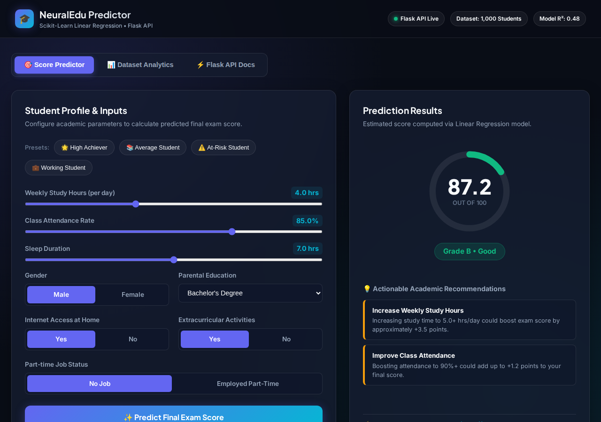

# 🎓 NeuralEdu Predictor (Student Performance Predictor ML App)

A full-stack, containerized Machine Learning web application that predicts student final exam scores based on study habits, attendance, sleep, and demographic factors. Built using **Python**, **scikit-learn**, **Flask**, **Gunicorn**, and **Docker**.



---

## 🚀 Features

- **🤖 ML Inference Engine**: Uses a trained `LinearRegression` model with standardized features (`StandardScaler`) and categorical one-hot encoding to predict student scores ($0–100\%$).
- **🎨 Interactive Dashboard**: Modern glassmorphic dark-themed web interface featuring real-time input sliders, an animated circular score gauge, and letter grade badges ($A, B, C, D, F$).
- **💡 Actionable AI Recommendations**: Automatically generates targeted academic and lifestyle recommendations based on student inputs (e.g., boosting study hours or optimizing sleep).
- **📊 Dataset Analytics**: Interactive visual charts powered by Chart.js displaying historical grade distributions, study time vs. score correlations, and attendance impact.
- **🌟 1-Click Profile Presets**: Pre-configured student profiles (*High Achiever*, *Average Student*, *At-Risk Student*, *Working Student*) for instant testing.
- **🔌 RESTful API**: Endpoint interface (`/api/predict`, `/api/analytics`, `/api/presets`, `/api/health`) for seamless external integration.
- **🐳 Production-Ready Dockerization**: Fully containerized using `python:3.11-slim`, Gunicorn WSGI server, non-root container security, and automated health checks.

---

## 📁 Project Directory Structure

```text
mlapp/
├── data/                  # 📊 Data directory
│   └── dataset.csv        # Historical student dataset (1,000 records)
├── models/                # 🤖 Trained ML models & pipeline artifacts
│   ├── linear_model.pkl   # Serialized scikit-learn LinearRegression model
│   └── pipeline.joblib    # Pipeline dictionary (model, scaler, metrics)
├── notebooks/             # 📓 Exploratory notebooks
│   └── notebook.ipynb     # Data analysis & ML prototyping notebook
├── src/                   # 🌐 Application source code
│   ├── __init__.py        # Package initializer
│   ├── app.py             # Flask Web Application & REST API server
│   └── model_pipeline.py  # Data preprocessing, training, & inference logic
├── static/                # 🖼️ Static assets
│   └── app_preview.png    # App screenshot preview
├── templates/             # 🎨 Web UI templates
│   └── index.html         # Interactive dashboard UI (Glassmorphic dark theme)
├── .dockerignore          # 🙈 Files excluded from Docker build context
├── Dockerfile             # 🐳 Container build recipe (Gunicorn & non-root user)
├── docker-compose.yml     # 🐙 Docker Compose service configuration
├── README.md              # 📖 Project documentation
└── requirements.txt       # 📦 Python package dependencies
```

---

## 🛠️ Quick Start Guide

### Option 1: Run with Docker Compose (Recommended)

**Prerequisites**: [Docker](https://docs.docker.com/get-docker/) & [Docker Compose](https://docs.docker.com/compose/)

1. **Clone or navigate to the project directory**:
   ```bash
   cd mlapp
   ```

2. **Start the application container**:
   ```bash
   docker compose up --build -d
   ```

3. **Access the application**:
   Open your browser and visit **`http://localhost:5000`**.

4. **Stop the container**:
   ```bash
   docker compose down
   ```

---

### Option 2: Run Locally (Python Environment)

**Prerequisites**: Python 3.10+ and `pip`

1. **Install dependencies**:
   ```bash
   pip install -r requirements.txt
   ```

2. **Train model and verify pipeline** *(optional - automatically runs on startup if model is missing)*:
   ```bash
   python3 src/model_pipeline.py
   ```

3. **Start the Flask development server**:
   ```bash
   python3 src/app.py
   ```

4. **Access the application**:
   Open your browser and visit **`http://localhost:5000`**.

---

## 📡 REST API Documentation

### 1. Predict Student Score
- **Endpoint**: `POST /api/predict`
- **Content-Type**: `application/json`

**Sample Payload**:
```json
{
  "study_time_hours": 6.5,
  "attendance_percent": 95.0,
  "sleep_hours": 8.0,
  "gender": "Female",
  "parental_education": "Bachelors",
  "internet_access": "Yes",
  "extracurricular_activities": "Yes",
  "part_time_job": "No"
}
```

**Sample Response**:
```json
{
  "success": true,
  "data": {
    "predicted_score": 98.53,
    "grade": "A",
    "status": "Excellent",
    "badge_color": "emerald",
    "recommendations": [
      {
        "type": "maintain",
        "title": "Keep Up the Outstanding Routine",
        "desc": "Your habits align strongly with top-tier academic performance!",
        "priority": "low"
      }
    ]
  }
}
```

---

### 2. Dataset Analytics
- **Endpoint**: `GET /api/analytics`
- **Description**: Returns statistical summaries, grade distributions, and correlation averages across 1,000 student records.

---

### 3. Presets
- **Endpoint**: `GET /api/presets`
- **Description**: Returns preset student profiles for rapid testing.

---

### 4. Health Check
- **Endpoint**: `GET /api/health`
- **Description**: Checks service vitality, model availability, and metric scores.

---

## 🧪 Model Performance Metrics

| Metric | Score |
| :--- | :--- |
| **Model Type** | `LinearRegression` |
| **$R^2$ Score** | `0.4769` |
| **Mean Absolute Error (MAE)** | `6.05` points |
| **Root Mean Squared Error (RMSE)** | `7.48` points |
| **Training Dataset** | 1,000 records (`data/dataset.csv`) |

---

## 📜 License

This project is open-source and available under the [MIT License](LICENSE).
